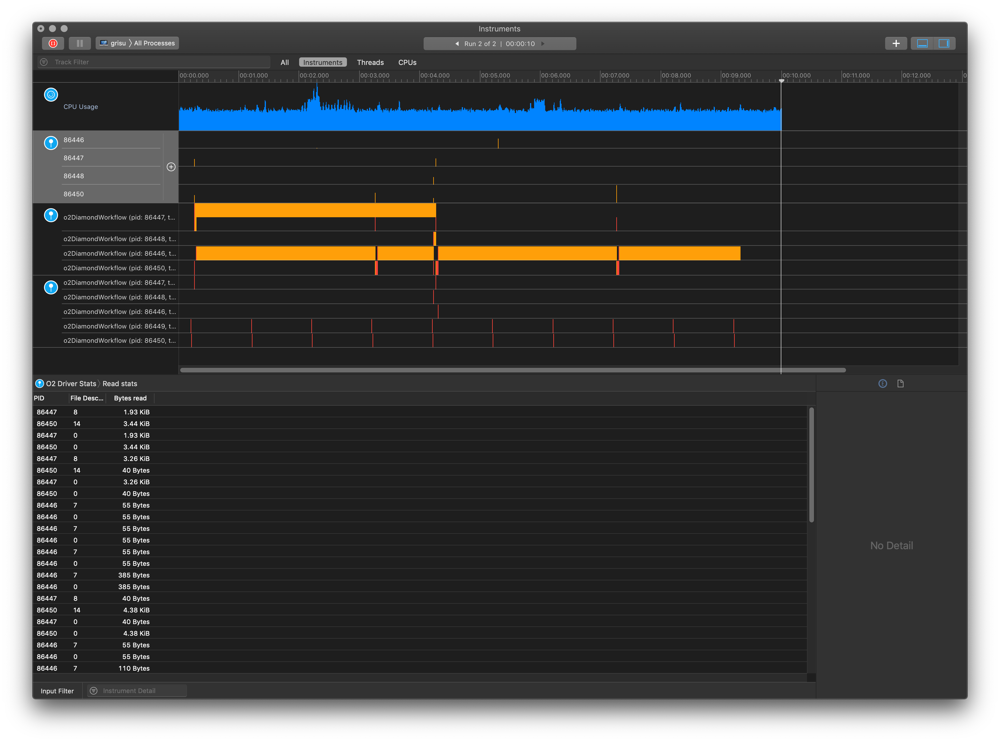

# O2 Dissociator : an Instruments plugin for AliceO2

This is a custom plugin for [Apple
Instruments](https://help.apple.com/instruments/mac/10.0/) (the profiler
Framework / GUI part of Apple's XCode developer suite). It allows for custom
views on the state of an Alice O2 processes, in particular (but not limited to)
those which use the Data Processing Layer.

It adds the following Instruments:

* O2 DPL State: which shows details about the current state of all the data
  processing devices, in particular:
   * It shows the intevals where a given device is DPL / FairMQ overhead.
   * It shows the intervals where a given device is in user processing callback.
   * It shows the intervals where a given device is in the error processing callback.

* O2 Driver Stats: which shows details about the current state of the DPL driver processing,
  in particular:
   * Amount of input logs read for each child.
   * Amount of input logs processed for each child.

* O2 Monitoring State: which shows details about the monitorning subsystem, as integrated in DPL.
  In particular it shows:
   * The intervals when relayed metrics are sent.
   * The intervals when all metrics are flushed.

## How does it work?

The traces are gathered via the mechanism provided in `Framework/Signpost.h`, i.e. the macros:

```
O2_SIGNPOST(...)
O2_SIGNPOST_START(...)
O2_SIGNPOST_END(...)
```

which are loosely documented at
(https://aliceo2group.github.io/AliceO2/db/de5/Signpost_8h.html). The macros
themself are wrappers around the Apple `kdebug_signpost` mechanism (see for
example presentation at <https://developer.apple.com/videos/play/wwdc2016/411/>
).

The actual instrument is created following the instructions at:

https://help.apple.com/instruments/developer/mac/current/

in order to extend it you need to have a look at the XML file `O2/O2.instpkg`
feel free to ask for help if you have signposts / intervals for which you would
like to have a custom instrument.

## What about linux?

In case you are using a Linux box (suggestions for alternatives to Instruments on Linux welcome),
this plugin will not be of much use, however the instrumentation in O2 using `O2_SIGNPOST`
will still be available via SystemTap.

## Obligatory screenshot:


